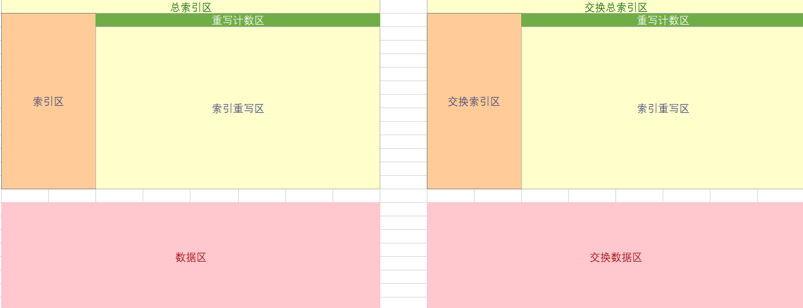

# flash_emulateEEprom

使用`flash`模拟`eeprom`的使用体验

## 特点

- 简单易用，只有**三个API函数**
	- `void ee_flashInit()`：格式化flash，只有格式化后的flash才能使用后面两个api函数。
	- `ee_uint8 ee_readDataFromFlash()`：读数据
	- `ee_uint8 ee_writeDataToFlash();`：写数据
- 容易维护，你只需要维护一个枚举变量表`variableLists`，通过此表读写flash中的数据
- 可以**随意更改**已经存入flash中**数据的大小、内容**
- 支持**所有可以按字节写入的flash**(nor flash)，你可以使用此程序管理spi_flash或其他单片机芯片中的片内flash

## 如何开始使用？

首先进入头文件，根据注释将**四个宏**填写完整
- `SECTOR_SIZE`:  当前flash一个扇区(flash的最小存储单元)容量大小
- `ee_flashWrite`: flash写操作驱动函数名
- `ee_flashRead`:  flash读操作驱动函数名
- `ee_flashEraseASector`: flash擦除一个扇区(flash的最小存储单元)驱动函数名

可填写的宏（不填不影响函数运行）

- `BLOCk_SECTOR_NUM`：当前flash一个块有多少个扇区

两个特殊的宏：

- `SECTORS(x)`：返回`x`扇区的总大小
- `BLOCKS(x)` :返回`x`块的总大小，要使用此宏，你需要事先填写宏`BLOCk_SECTOR_NUM`

上面两个宏，主要用于`ee_flashInit()`函数传参方便定位flash地址使用。

实例：
```c
// 首先在flash_MemMang.h枚举类型中添加数据名，用于管理数据
typedef enum
{
	// 用户将变量名添加到下面
	G_MYSENSORDATA,
	G_FLOAT,

	// DATA_NUM用于标识flash中一共存了多少个数据(不允许删改)
	DATA_NUM,
} variableLists;

//------------------主函数-------------
/* 创建flash内存管理句柄 */
ee_flash_t g_fm;

/* 想要存入flash中的变量 */
int g_mySensorData = 16;
float g_float = 3.14;

char g_txt[20] = "change data test";

int main(void)
{
	int dataTmp = 0;
	float ftmp = 0;
	char tt[20];

	/* 格式化传入地址的格式 */
	ee_flashInit(&g_fm,       /* 管理句柄 */
                 SECTORS(0),  /* 索引区起始地址 */
                 SECTORS(2),  /* 交换索引区起始地址 */
                 2,           /* 总索引区大小(单位：扇区) */
                 1,           /* 索引区大小(详见README图例，indexRegionSize) */
                 SECTORS(4),  /* 数据区起始地址 */
                 SECTORS(5),  /* 交换数据区起始地址 */
                 1);          /* 数据区大小(单位：扇区) */

	/* 数据写入顺序错误，写入失败 */
	ee_writeDataToFlash(&g_fm, &g_float, sizeof(g_float), G_FLOAT);
	ee_writeDataToFlash(&g_fm, &g_mySensorData, sizeof(g_mySensorData), G_MYSENSORDATA);

	/* 正确将数据写入flash */
	ee_writeDataToFlash(&g_fm, &g_mySensorData, sizeof(g_mySensorData), G_MYSENSORDATA);
	ee_writeDataToFlash(&g_fm, &g_float, sizeof(g_float), G_FLOAT);

	/* 将数据读出 */
	ee_readDataFromFlash(&g_fm, &dataTmp, G_MYSENSORDATA);
	ee_readDataFromFlash(&g_fm, &ftmp, G_FLOAT);

	/* 将G_FLOAT管理的数据改成g_txt */
	ee_writeDataToFlash(&g_fm, g_txt, strlen(g_txt) + 1, G_FLOAT);

	/* 再读取一次数据 */
	dataTmp = 0;
	ee_readDataFromFlash(&g_fm, &dataTmp, G_MYSENSORDATA);
	ee_readDataFromFlash(&g_fm, &tt, G_FLOAT);
	
}
```

## 注意事项：

- 每个数据的大小**最大64KB**（可升级最大为4GB）
- 每个区域的大小**最大64KB**（可升级最大为4GB）
- 在写入数据时，你需要**按照枚举表中的顺序，从上往下依次写入**（主要为了快速寻址数据区空闲地址）

## 基本原理

flash只能将1变成0，只能通过擦除一整个扇区(flash的最小存储结构)才能将0变成1，因此对于一个被写过的地址，如果再次对其进行写入，必定会导致已经变成0的位无法变成1，从而导致数据无效。

本程序的思路就是将想要改写的数据写入后面没被写过的区域，之前写入的数据就被作废，将最新写入的数据当作有效的。等到整个区域被写满，将有效数据搬移另外一个区域，再将当前区域一块全部擦除。

程序实现的flash的内部结构图：



当执行`void ee_flashInit()`格式化flash后，格式化后的flash布局如上图所示。

- 总索引区：包含两个区域，**索引区和重写区**

  - **索引区**：用于保存每个数据的索引结构，每个索引结构的地址位置是固定的，如1号数据的地址在0x00，那么2号数据索引的地址就在0x08，用户可指定索引区的大小，大小指定可以参考后面公式：**索引区可存储数据的个数 = 索引区总字节数 / 8**

    ```c
    /* 数据索引结构 */
    typedef struct 
    {
    	/* 当前数据状态 */
    	ee_uint16 dataStatus;
    	/* 当前数据大小 */
    	ee_uint16 dataSize;
    	/* 当前数据在数据区的地址(相对于dataStartAddr的偏移地址) */
    	ee_uint16 dataAddr;
    	/* 当前数据被重写的地址(相对于overwriteAddr的偏移地址)，默认为0xFFFF */
    	ee_uint16 dataOverwriteAddr;
    }ee_dataIndex;
    ```

  - **重写区**：当数据索引区的数据被重写后，重写后的索引结构保存在当前区域
  - **重写计数区**：由程序自动分配，用户不需要在意，此区域记录当前重写区一共写入了多少次，用于定位重写区的空闲位置。

- 数据区：保存我们存入flash中实际的值，每个值的**大小、读写偏移地址**由索引区的索引结构管理。

**交换区**：当活动区满了之后，将活动区的所有有效数据效索引搬运到此区域，当做活动区域，同时清空之前的活动区，当作下一次活动区域使用

---

**状态管理**：

- 对于每个区域，使用当前区域的前4个字节用于标识区域的状态。
- 对于每个索引结构，我使用2个字节用于标识当前结构的状态。

状态管理用于处理单片机出现各种的异常现象，如单片机在操作flash时发生了断电情况。

